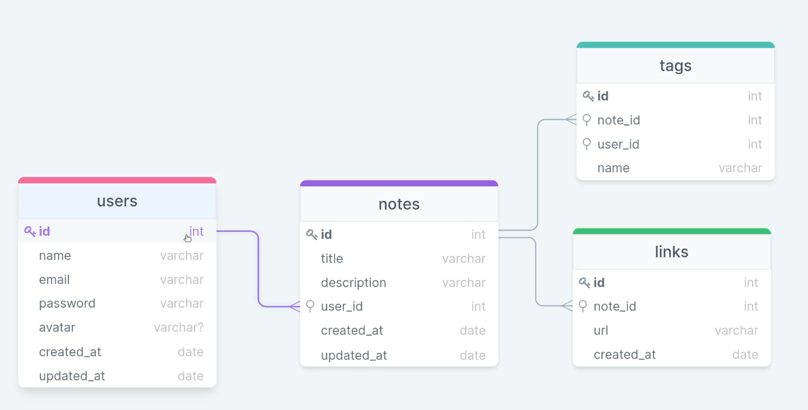

Develop a complete back-end using Node.js
🛠️: NODE.JS || SQLite || Query Builder

-- Express-- || --Insonmia || -- BeekeeperStudio || --

💾Database structure: 

 
 Preparing deployment:
 Dotenv: https://www.npmjs.com/package/dotenv#-install
 PM2: https://pm2.keymetrics.io/docs/usage/quick-start/

 The deployment solution: 
 https://dashboard.render.com/

 other options: 
 https://railway.app/new

 Testing: https://jestjs.io/es-ES/docs/getting-started
 install: 
 1 - npm install --save-dev jest
 2- npx jest --init 